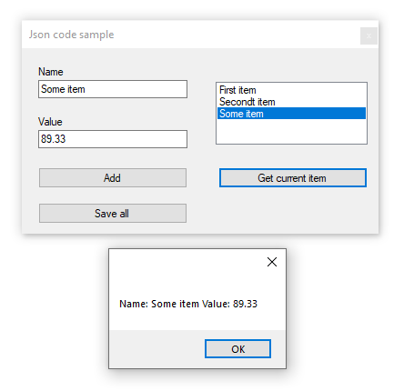

# About

Conceptual code sample for storing a list in a json file.

- INotifyPropertyChanged is used for permitting updates to the user interface
- BindingList is used in tangent with INotifyPropertyChanged

# Requires 

NuGet package [Newtonsoft.Json](https://www.nuget.org/packages/Newtonsoft.Json/)



# Side code sample

For forum quesiton were forum member wanted to use xml, read and group. All classes used are under the Class folder with class names starting with Asset.

```csharp
Private Sub Button1_Click(sender As Object, e As EventArgs) _
    Handles Button1.Click

    AssetOperations.MockAssets()

    Dim assetList As List(Of Asset) = AssetOperations.ReadAssets()

    Dim results As List(Of AssetGrouping) = (
            From asset In assetList
            Group By category = asset.Category Into g = Group
            Select New AssetGrouping With {.Category = category, .AssetList = g.ToList()}).ToList()

    For Each assetGrouping As AssetGrouping In results
        Console.WriteLine(assetGrouping.Category)
        For Each asset As Asset In assetGrouping.AssetList
            Console.WriteLine($" {asset.Name}, {asset.IsInstalled}")
        Next
    Next


    Dim julie = assetList.FirstOrDefault(Function(asset) asset.Name = "Julie")
    If julie IsNot Nothing Then
        julie.Name = "Julie Anne"
        AssetOperations.UpdateAsset(assetList)
    End If

End Sub
```
