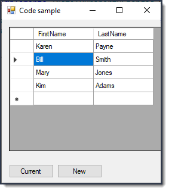

# About

Shows how to permit immediate updates and sorting in a DataGridView. A customer BindingList is used to provide sorting capabilities in the DataGridView and INotifyPropertyChanged implemented in the Person class for immediate updates to be seen.

