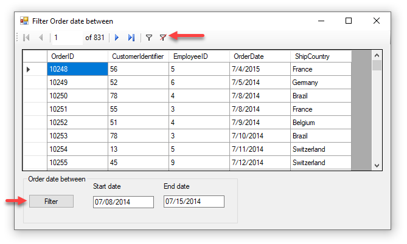
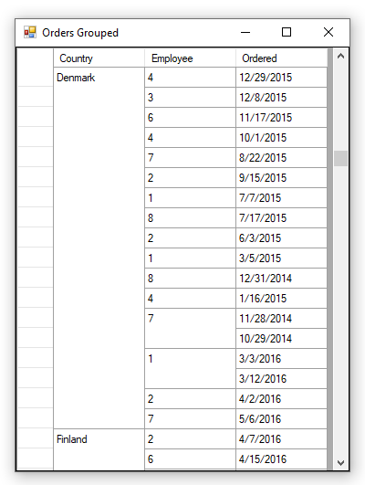

# About

Demonstrates how to filter date between two dates via a BindingSource Filter and remove a filter also.

> Added a off-topic code sample for grouping a DataGridView for the first column. To try it out change the startup form to OrderFormGrouped. See last screenshot.

### Notes
- In code there is proper assertion as DateTimePickers are not used. There are two trains of thoughts, use DateTimePicker for proper validation or allow users to be trusted to enter proper dates as in some applications.
- No validation done to determine if say end date is before start date, again we trust the user in this case. Feel free to alter to suit your requirements.
- Make sure to run the database script in the script folder.

## Grouped

