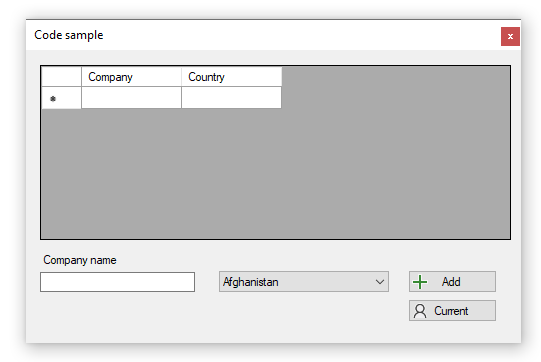

# About

Shows how to add row to a DataGridView from a TextBox and ComboBox. The Country column in the DataGridView is a DataGridViewComboBox which after adding a row use the Current button to see what the current row values are.

Both the DataGridViewComboBox and the ComboBox are loaded from a .json file with 200 plus countries although only the first 20 are used.

