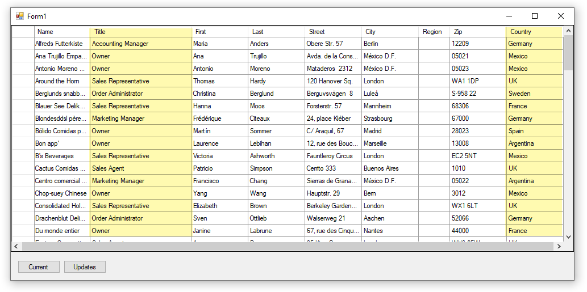

# DataGridView ComboBox (VB.NET)

## A work in progress

Basic starter project to learn how to work with DataGridViewComboBox columns in a DataGridView using SQL-Server modified NorthWind database.

- Not all aspects are coded yet there is enough to get a developer started.
- For several operations delegates/events are utilized
- Working with DataTable containers in this case events are used that are set in DataTableEvents class.
- Written in Microsoft Visual Studio 2017 and will run under newer releases of Visual Studio.
* Main classes
  * [Operations](https://github.com/karenpayneoregon/visual-basic-getting-started/blob/master/DataGridViewComboBoxes/Classes/Operations.vb) (all data operations)
  * [DataTableEvents](https://github.com/karenpayneoregon/visual-basic-getting-started/blob/master/DataGridViewComboBoxes/Classes/DataTableEvents.vb) (home for all DataTable events)
  

## Before running this project

Run the database script, DatabaseScript.sql found in this project. Open the script in Visual Studio or in [SSMS](http://example.com), make sure the path to place the database is correct for your computer then execute the script.

## Entity Framework/Entity Framework Core

The current code would be much less using any flavor of Entity Framework for many operations. No plans for Entity Framework 6 code samle to match this as Entity Framework 6 although it's still a choice developers need to move up to EF Core which does not have native reverse engineering so to present this there would also need to be a lesson on reverse engineering a database which is outside the scope of this artice.

