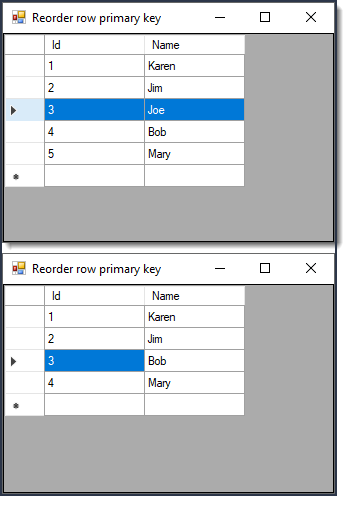

# About

[Forum question](https://docs.microsoft.com/en-us/answers/questions/185507/auto-number-increment.html) user wanted to reorder rows of a DataGridView after deleting a row.

Here the best option is to use a DataSource for a DataGridView e.g. DataTable. For in the wild a BindingSource would use the DataTable then the DataGridView would use the BindingSource but for this sample that would cloud what is being taught.

Here Joe row is removed then we reorder the primary key.

