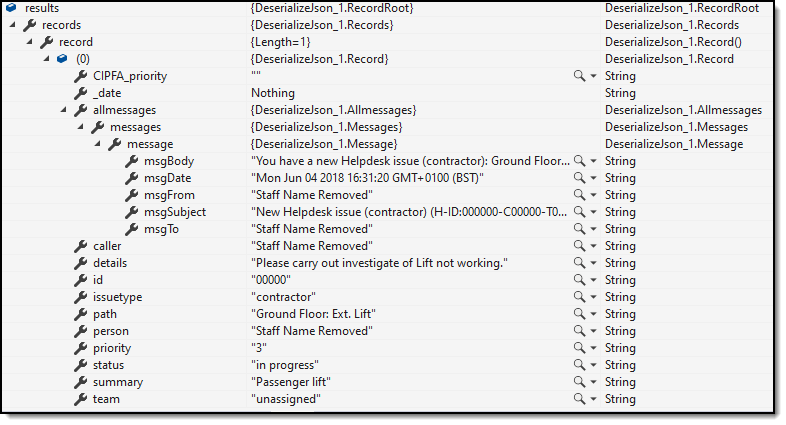

# About

Simple code sample using [System.Text.Json](https://www.nuget.org/packages/System.Text.Json/) (which must be installed via NuGet)to deserialize json (in this case to answer a forum question).



### json

```json
{
    "records": {
        "record": [
            {
                "date": "Mon Jun 04 2018 16:31:18 GMT+0100 (BST)",
                "summary": "Passenger lift",
                "issuetype": "contractor",
                "team": "unassigned",
                "priority": "3",
                "path": "Ground Floor: Ext. Lift",
                "caller": "Staff Name Removed",
                "CIPFA_priority": "",
                "person": "Staff Name Removed",
                "details": "Please carry out investigate of Lift not working.",
                "allmessages": {
                    "messages": {
                        "message": {
                            "msgSubject": "New Helpdesk issue (contractor) (H-ID:000000-C00000-T000000): Ground Floor: Ext. Lift: 'lift '",
                            "msgTo": "Staff Name Removed",
                            "msgFrom": "Staff Name Removed",
                            "msgBody": "You have a new Helpdesk issue (contractor): Ground Floor: Lift: 'lift '\n\nHelpdesk issue (contractor) details:\nPlease carry out investigate of Lift not working.\n\nNOTE: either sender and recipient were the same or an attempt to also send this message by email and/or SMS on (Mon Jun 04 2018 16:31:30 GMT+0100 (BST)) was NOT successful. Please check relevant email/phone number details!",
                            "msgDate": "Mon Jun 04 2018 16:31:20 GMT+0100 (BST)"
                        }
                    }
                },
                "id": "00000",
                "status": "in progress"
            }
        ]
    }
}
```

