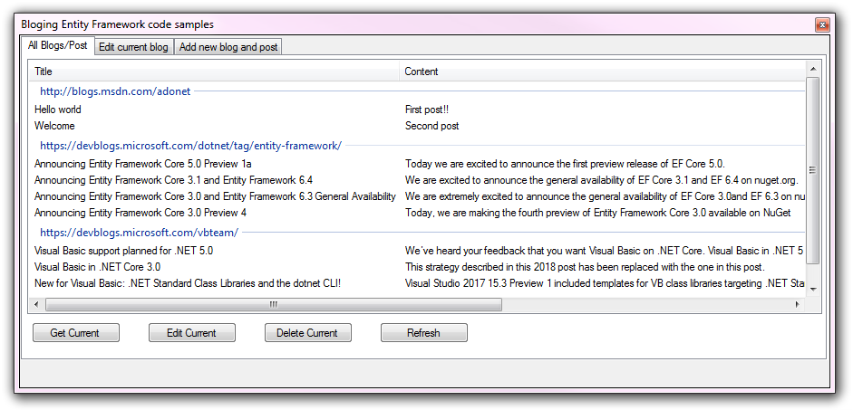
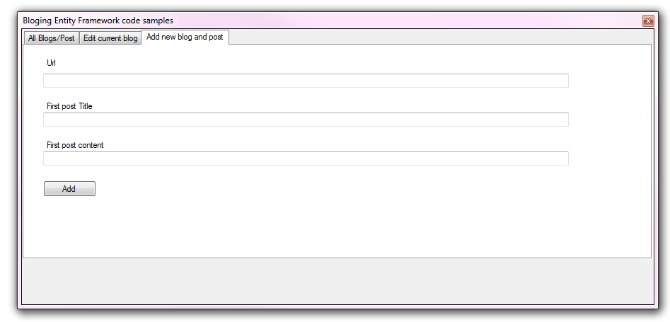
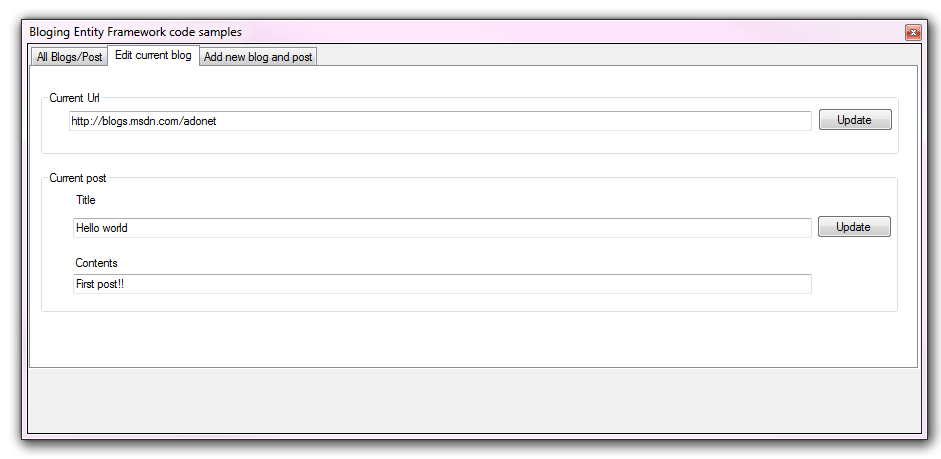

# Entity Framework (VB.NET) - getting started

The model used and code samples are based off C# code samples from Microsoft found under [the following page](https://docs.microsoft.com/en-us/ef/) which has been done as there are no VB.NET code samples. 

Rather than expand the model to include some missing columns e.g. URL for post they were not added to keep inline with the original code samples in C#.

[Microsoft TechNet article](https://social.technet.microsoft.com/wiki/contents/articles/53700.entity-framework-6-basic-data-operations-vb-net-window-forms.aspx)

**Requires**
SQL-Server installed, Visual Studio 2017 or higher

