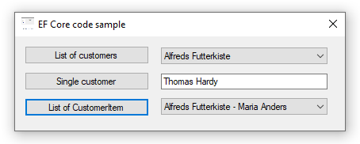

# About

Entity Framework code sample for reading using projections along with operations that are Task-based Asynchronous Pattern

New to Async? See [Async Await Best Practices Cheat Sheet](https://gist.github.com/jonlabelle/841146854b23b305b50fa5542f84b20c).

## How to run

* Open DataScripts.sql in either SSMS (SQL-Server Management Studio) or in a .sql file in Visual Studio.
* Run the script to create the database, tables and populate tables.
* From Solution Explorer in Visual Studio, right click on the restore NuGet packages to download missing packages.
* Build the projects
* Run the project EntityFrameworkCoreNorthFrontEnd
