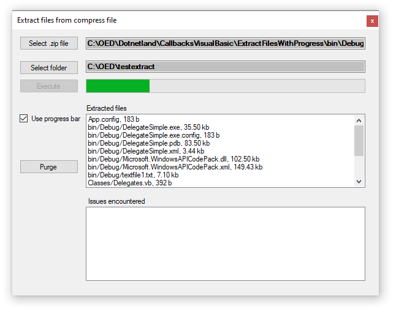

# Extract files from .zip

This projects shows how to do a simple extract files from a .zip file with ProgressBar using two Delegates to provide progress and runtime exceptions during file extraction in Visual Basic.

### Important

Requires **Restore Nuget packages** before building the project.

