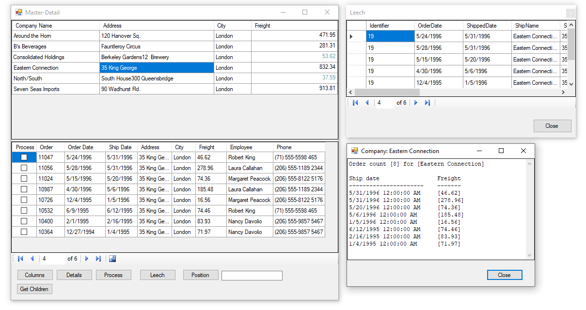

# About

Example for master-details using a Microsoft Access database. Data operations are in the project MasterDetailsDataLibary. In the screenshot below, the form with the title "Leech" follows the main form when moved.

