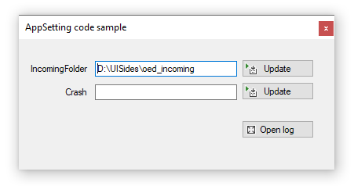
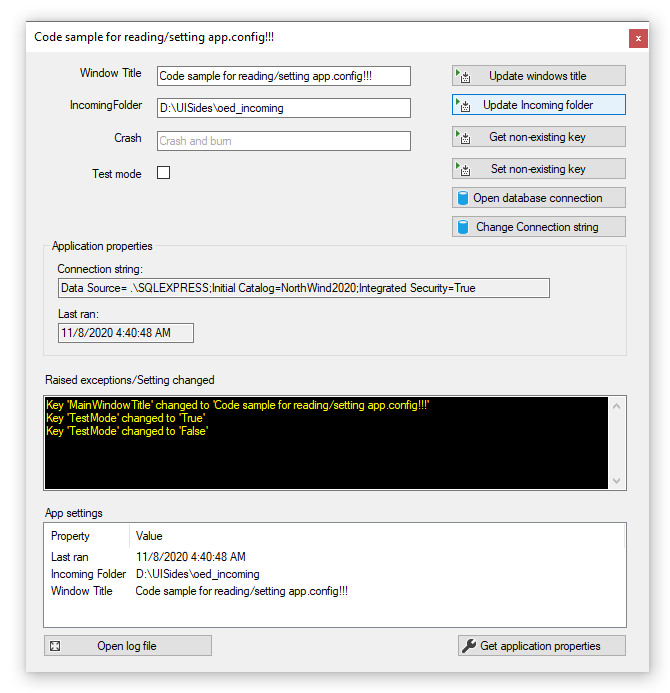

# About

Code sample for alternate to using My.Settings.

- Shows how to read and change items in app.config at runtime
- Write to an error log file.

## Requires

- The following [database script](https://gist.github.com/karenpayneoregon/9bdf1a7d5310ac1d562b2326d79d6038) for data operations.

 

