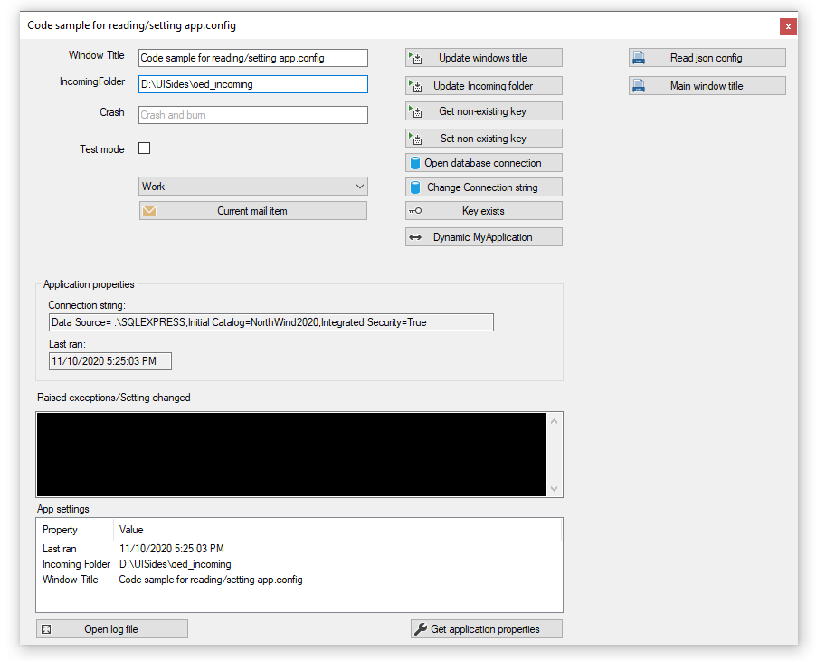
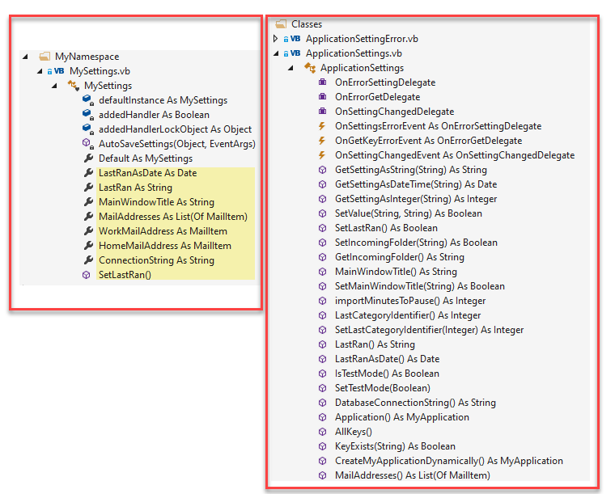

# About

Code sample for alternate to using My.Settings.

- Shows how to read and change items in app.config at runtime
- Option to use My.Setting which has been customized in this project.
- Shows working with a .json file for configuration also.
- Write to an error log file.
- Any unhandled exceptions are handled in ApplicationsEvents.vb only at run time, during debuggings an unhandled exception will not be handled.

## TechNet article

TODO

## Requires

- The following [database script](https://gist.github.com/karenpayneoregon/9bdf1a7d5310ac1d562b2326d79d6038) for data operations.

 

(old screenshot but still works)

