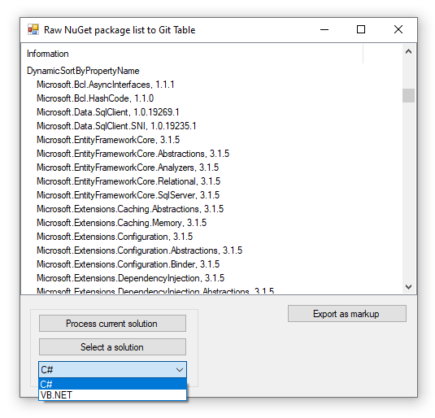

# About Format package listing

Execute in Package manager console: **Get-Package | ft -AutoSize** then run this project to get a formatted GitHub markdown table suitable for a readme.md file.

- Currently list packages for VB.NET or C#
- Export part is still under development as the format has not been decided e.g. should it be HTML, CSV, Markdown table or options for all by selection say in a ComboBox.

> This version does not fully work with VS2019, In VS2019, those .net core projects or .net standard projects use [PackageReference](https://docs.microsoft.com/en-us/nuget/consume-packages/package-references-in-project-files) 
> instead of [packages.config](https://docs.microsoft.com/en-us/nuget/reference/packages-config) format to manage nuget packages.

### Current screenshot

This was done against the following VS2017 solution (in this [GitHub repo](https://github.com/karenpayneoregon/NorthWind-2020)).
