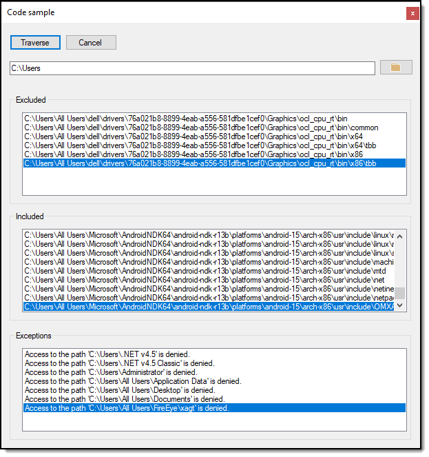

# About

Code sample which recursively iterates a folder structure.

### Requires

NuGet package [BetterFolderBrowser](https://www.nuget.org/packages/BetterFolderBrowser/) for selecting folders only thus is optional when using the code in this project in other projects.

### Visual Studio

Coded in VS2017 and will work in VS2019, not tested in earlier releases of Visual Studio.

### Notes

-  File operations are in [the following class project](https://github.com/karenpayneoregon/visual-basic-getting-started/tree/master/FileHelpers) in this repository.
-  Not coded, disabling the Traverse button, if clicked while running it will restart processing.
-  Generally cancellations are wrapped in the caller but here this is not the case, instead the cancellation is handled in [RecursiveFolders method](https://github.com/karenpayneoregon/visual-basic-getting-started/blob/master/FileHelpers/Operations.vb#L61).
-  The [property Cancelled](https://github.com/karenpayneoregon/visual-basic-getting-started/blob/master/FileHelpers/Operations.vb#L31) in Operations class must be reset on each call to RecursiveFolder which is done in this code sample.
-  Events are hooked up once in form load.

