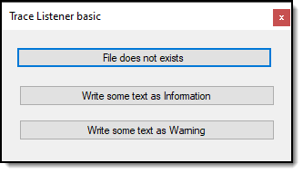

# About

Simple TraceListener wrapped in a singleton class.



```csharp
Imports LogLibrary

Public Class Form1
    Private Sub FileDoesNotExistsButton_Click(sender As Object, e As EventArgs) _
        Handles FileDoesNotExistsButton.Click

        Dim fileOperations = New Reader()
        fileOperations.GetLines()

    End Sub

    Private Sub WriteSomeTextAsInformationButton_Click(sender As Object, e As EventArgs) _
        Handles WriteSomeTextAsInformationButton.Click

        ApplicationTraceListener.Instance.Info("hello from a button click")

    End Sub

    Private Sub WriteSomeTextAsWarningButton_Click(sender As Object, e As EventArgs) _
        Handles WriteSomeTextAsWarningButton.Click

        ApplicationTraceListener.Instance.Warning("A simple warning")

    End Sub
End Class
```

# Read these bullet points

1. Requires a reference to System.Configuration.
2. Requires a reference to the project (in this solution). [LogLibrary](https://github.com/karenpayneoregon/visual-basic-getting-started/tree/master/LogLibrary)
3. See initialization and finalization code in ApplicationEvents
4. See how app.config configures the TraceListener
5. Information is written to applicationLog.txt in the executable folder

### app.config

```xml
<?xml version="1.0" encoding="utf-8" ?>
<configuration>
  <startup>
    <supportedRuntime version="v4.0" sku=".NETFramework,Version=v4.7.2" />
  </startup>
  <system.diagnostics>
    <trace autoflush="false" indentsize="4">
      <listeners>
        <add name="myListener" type="System.Diagnostics.TextWriterTraceListener" initializeData="TextWriterOutput.log" />
        <remove name="Default" />
      </listeners>
    </trace>
  </system.diagnostics>

  <appSettings>
    <add key="SidesListenerName" value="PayneListener" />
    <add key="SidesListenerLogName" value="applicationLog.txt" />
  </appSettings>

</configuration>
```


