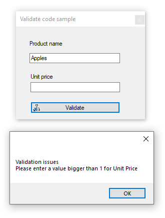

# Form validate with Annotations

Very basic code sample for validating user input using data annotations.

### Uses

- WinFormsValidation project
- WinFormsControls project 

### Requies 

- Reference to System.ComponentModel.DataAnnotations.dll (add as another other reference)

